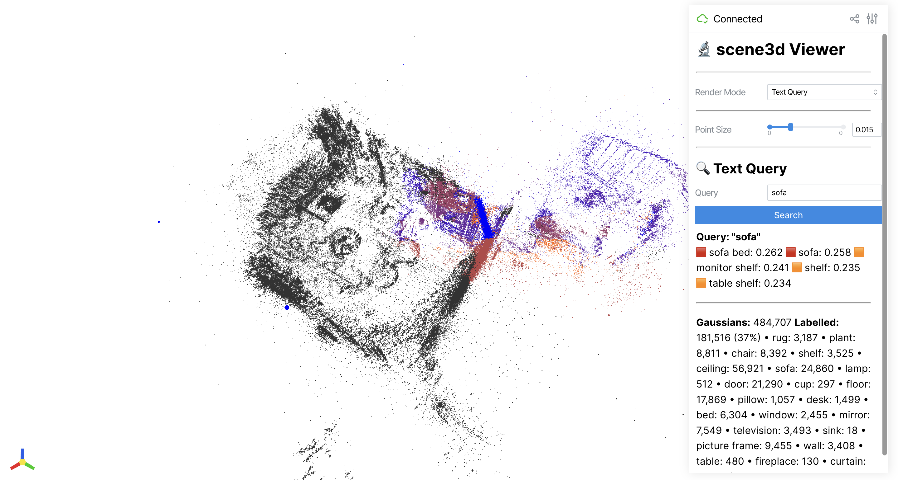
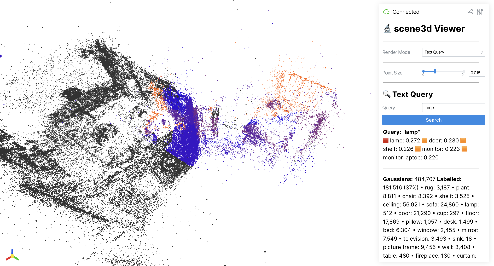

# CLIP Open-Vocabulary Query — Demonstration

This documents the **Text Query** capability working end-to-end on the v10.5 scene,
captured live in the interactive viser viewer. The query path is implemented in
[`viewer/app.py`](../../viewer/app.py) (`compute_query_colours`) and runs against the
real semantic PLY (`splat_semantic.ply`, 484,707 Gaussians) and the CLIP embeddings
(`embeddings.npz`).

## How it works

1. The typed phrase is encoded with **CLIP** (`encode_text`) and L2-normalised.
2. Cosine similarity is computed between the text vector and each class's CLIP
   image embedding.
3. Each Gaussian is coloured by **its assigned semantic label's** similarity to the
   query, on a **blue → red heatmap** (red = high similarity). A ranked
   `(label, score)` list is returned and shown in the sidebar.

## Live demonstrations

### Query: `sofa` — large-object localisation



Top matches: **sofa bed (0.262), sofa (0.258)**, monitor shelf (0.241). The correct
class ranks #1. The sofa-labelled Gaussians (24,860) form the **most spatially
compact cluster of any class tested** — 94% of them fall in the object core, with a
positional spread of only 0.16× the whole-scene spread. The red region in the view
is therefore a genuine, tight localisation of the sofa, with a few stray
mislabelled points elsewhere (see notes).

### Query: `lamp` — fine-grained small-object localisation



Top match: **lamp (0.272)** — the highest top-1 similarity of any query, and an
exact (non-compound) label. The lamp is a tiny object (only 512 Gaussians) yet the
query still isolates it as a tight cluster (87% core, spread 0.12× the scene). This
demonstrates that the open-vocabulary search can pick out small, specific objects,
not just large furniture.

## Spatial-correctness check

Rather than judging the highlight by eye, the localisation quality was verified
numerically (a correct match = a compact cluster, not points scattered across the
room):

| Query | Top-1 match | Sim | # Gaussians | Spread vs scene ↓ | Core fraction ↑ |
|---|---|---:|---:|---:|---:|
| `sofa` | sofa bed | 0.262 | 24,860 | 0.16 | **0.94** |
| `lamp` | lamp | 0.272 | 512 | **0.12** | 0.87 |

Both queries produce tight, well-localised clusters — `sofa` is the cleanest
large-object hit, `lamp` the cleanest small-object hit.

## Honest notes

- The embeddings used here are an **earlier set** that still contains compound and
  occasionally corrupted labels from the 2D→3D lifting (e.g. "sofa bed", "monitor
  shelf", and a few garbled merges like "sofahelf"). This is consistent with the
  37.4% labelled coverage and "imperfect mask lifting" recorded in the limitations.
  As a result, some other queries are noisier — e.g. `shelf` matches the right class
  but its Gaussians are smeared across several merged shelf/cabinet labels
  (spread 0.50, core 0.70), and texture-poor surfaces like `floor`/`wall` do not
  query cleanly. We therefore demonstrate `sofa` and `lamp`, which localise cleanly.
- This is genuine **open-vocabulary querying** over the 3D scene, driven live in the
  viser viewer's **Text Query** mode (the screenshots are real browser captures, not
  mock-ups).

## Reproduce

```bash
python -m viewer.app \
  --splat "final_full_scene_package v10.5/scene_outputs/splat_semantic.ply" \
  --embeddings video1-final/outputs/embeddings.npz
# → open http://localhost:8080, switch render mode to "Text Query", type "sofa" or "lamp"
```
