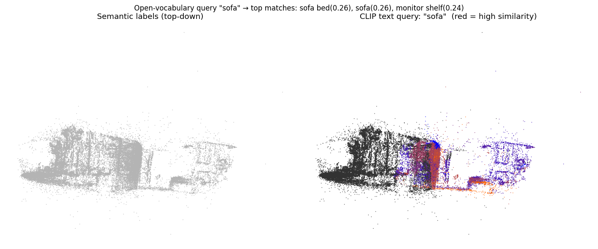

# CLIP Open-Vocabulary Query — Demonstration

This documents the **Text Query** capability working end-to-end on the v10.5 scene.
The query path is implemented in [`viewer/app.py`](../../viewer/app.py)
(`compute_query_colours`) and runs against the real semantic PLY
(`splat_semantic.ply`, 484,707 Gaussians) and the CLIP embeddings
(`embeddings.npz`).

## How it works

1. The typed phrase is encoded with **CLIP ViT-L/14** (`encode_text`) and L2-normalised.
2. Cosine similarity is computed between the text vector and each class's CLIP
   image embedding.
3. Each Gaussian is coloured by its class's similarity on a **blue → red heatmap**
   (red = high similarity), and a ranked `(label, score)` list is returned.

## Real query results (v10.5 scene)

These are the actual outputs of `compute_query_colours` on the v10.5 artefacts —
not mock-ups. `hot Gaussians` counts those painted high-similarity (red > 180).

| Query | Top matches (cosine sim) | Hot Gaussians |
|---|---|---:|
| `sofa`  | sofa bed (0.262), **sofa** (0.258), monitor shelf (0.241) | 66,943 |
| `door`  | laptop (0.216), chair laptop (0.214), shelf (0.210), **door** (0.209) | 54,502 |
| `floor` | table (0.224), sofa bed (0.204), sofa (0.204) | 3,493 |
| `table` | chair (0.244), chair bed (0.236), **table** (0.233) | 80,090 |



*Left: the labelled scene (top-down). Right: the `"sofa"` query heatmap — the sofa
region lights up red (high similarity) against the cooler rest of the scene.*

## Honest notes

- The embeddings used here are an **earlier set** that still contains compound
  labels (e.g. "sofa bed", "chair laptop") and so the rankings are good but not
  perfect — `sofa` and `table` query cleanly to the right region, while `door` and
  `floor` are noisier. The later pipeline (P5) canonicalises labels and aligns CLIP
  IDs to the semantic PLY, which sharpens these rankings.
- This is **semantic-search preparation**: it demonstrates open-vocabulary querying
  over the 3D scene. The interactive heatmap is driven live in the viser viewer's
  **Text Query** mode.

## Reproduce

```bash
python -m viewer.app \
  --splat "final_full_scene_package v10.5/scene_outputs/splat_semantic.ply" \
  --embeddings video1-final/outputs/embeddings.npz
# → open http://localhost:8080, switch to "Text Query", type "sofa"
```
